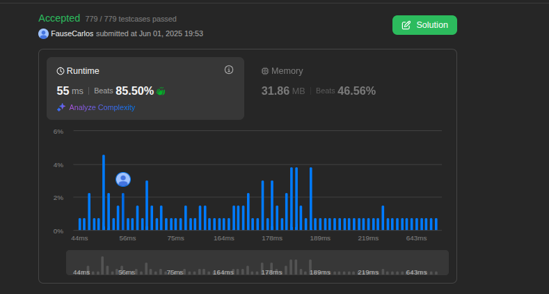

# Greed_Questions

**Número da Lista**: X 
**Conteúdo da Disciplina**: Greed 

## Alunos
|Matrícula | Aluno |
| -- | -- |
| 21/1031691  |  Fause Carlos Mascarenhas Lustosa Junior |
| 19/0116072  |  Raphaela Guimarães de Araujo dos Santos |

## Sobre 

|Problema | Dificuldade |Vìdeo |
| -- | -- |-- |
| [630. Course Schedule III](https://leetcode.com/problems/course-schedule-iii/description/) |  Difícil|[clique aqui](https://youtu.be/Mg2VfZrjOQE) |
| [2931. maximum spending after buying items](https://leetcode.com/problems/maximum-spending-after-buying-items/) |  Difícil|[clique aqui](https://youtu.be/k7pr_hEVZNE) |
| [Minimum time to Complete All Tasks](https://leetcode.com/problems/minimum-time-to-complete-all-tasks/) | Difícil |[clique aqui](https://youtu.be/-sFem3l0zzU) |

## Screenshots
Screenshots do resultado das submissões das questões no leetcode.

Questão: 1

Questão: - 630. Course Schedule III

    

Questão: 2

Questão:2931. maximum spending after buying items

    

Questão 3:

    

Questão: 

## Instalação 
**Linguagem**: Python 

